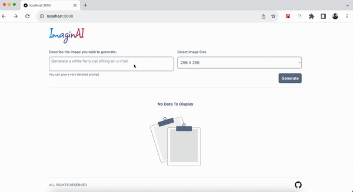

# ImaginAI

  

ImaginAI accepts user prompts to generate images in three choose-able sizes - 256x256, 512x512 and 1024x1024.
ImaginAI calls DALL-E OpenAI model to generate images. 

You can tweak the number of images to be generated per prompt. And download the image as well

## Pre-requisites to run this project

1. OpenAI API Key

## Steps to run this project

1. Clone the repo
2. Run `npm install` to install all the dependencies
3. Create a `.env.local` from `env-example` file: `cp env-example .env.local`
4. Update the OpenAI key in the `.env.local` file
5. Run `npm run dev` to start the project

## Tech Stack:

- NextJS
- TailwindCSS
- DALL-E Model

## Contact

mohdejazsiddiqui@gmail.com